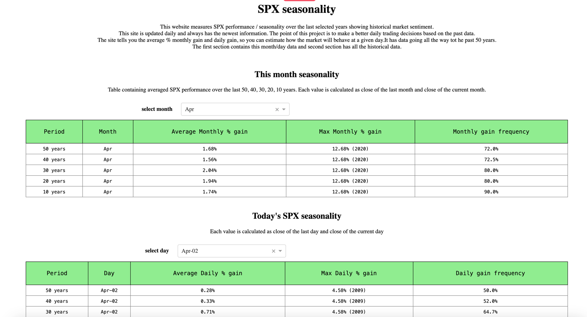
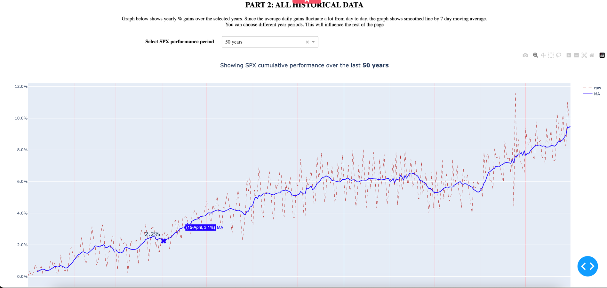
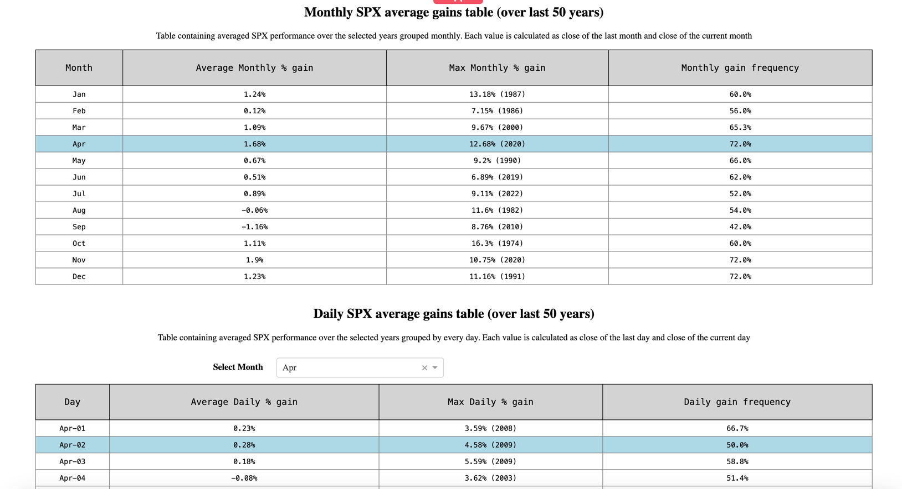

# This repository includes dash website for market seasonality over the last 50 years

  - This website is live on https://www.marketseasonality.com
  - It includes data on S&P500 for the last 50 years giving all sorts of information about market seasonality like 
Average % gain in any month, daily gains, max gains, graphs and statistics.
  - All market data are from Yahoo
  
## Requirements

All needed requirements for running project you can find in requirements.txt

## Code Formatting

The project uses black to format source codes (not included in requirements).
    1. `pip install black`

## Running the Website

To start the import process of products you can easily do it by running the command below

```bash
python index.py
```
## Configuration
* create config.json file with the structure of the config-template.json
#### For running website locally: 
* Change the variable test in the index.py to 1
* Run the index and go to the url http://127.0.0.1:8050/
#### For running website on a server:
* You need a WSGI server compatible with waitress
* Fill in server_ip_port.json with your IP and port
* Make sure your port is not blocked by the firewall

## How the website looks like:




